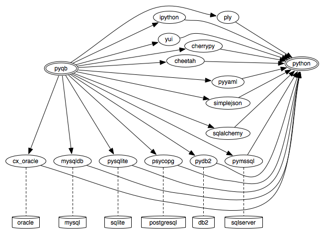

Dependencies
============
PyQB is written in python and relies on standard python modules.
Below you can see current set of dependencies for PyQB:

Below we list all dependencies clarifying their role for PyQB

- *python*, PyQB is written in python, see [Python]_;
- *cherrypy*, a generic python web framework, see [CPF]_;
- *yui* the Yahoo YUI Library for building richly interactive web
  applications,
  see [YUI]_;
- *yaml* a human-readable data serialization format, a python YAML
  library is used for QL maps and server configurations, see [YAML]_;
- *Cheetah* is python template framework, used for all DAS web tempaltes, 
  see [Cheetah]_;
- *sphinx* a python documentation library servers all DAS documentation, 
  see [Sphinx]_;
- *ipython* is an interactive reach python shell (optional, used in some
  admin tools), see [IPython]_;
