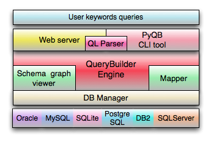

PyQB architecture
=================

PyQB architecture is basd on the following component:
   - PyQB core

      - Parser
      - Mapper
      - QueryBuilder
      - DBManager
   - web server
   - CLI tool 

PyQB Workflow can be summerized as:
   - PyQB core recieved a QL query from client(either web server or
      Commandline tool)
   - The input query is parsed and the keywords and constrants are
      identified and mapped to the appropriate table/column
   - SQL queries are generated and executed by DBManager
   - Results are formatted and return to the user.

 
