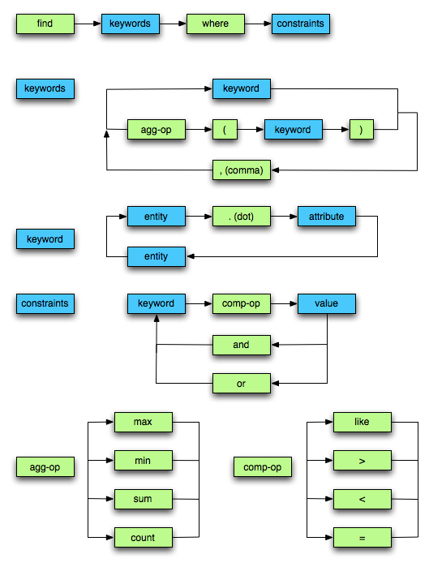

PyQB Query Language
===================

PyQB Query Language (PyQB-QL) provides intuitive, precise
attribute-value style keywords queries to structured data
over relational database.

It's syntax is 

.. doctest::

    find <keyword>, <keyword>, ... where <keyword> <comp-op> <value>, ... 
    find <agg-op> ( <keyword> ) where <keyword> <comp-op> <value>

*<entity>* and *<entity.attribute>* are predefined *<keyword>* according to the published
database, e.g. dataset, block.numevents. See :ref:`PyQB Mapper <pyqb_mapping>`.

*<agg-op>* are the aggregator operator: *sum*, *count*, *max*, *min*.
wild-card patterns are supported via asterisk character.

For example:

.. doctest::

    find file where dataset = /a/b/c
    find count(file) where dataset = /a/b/*

