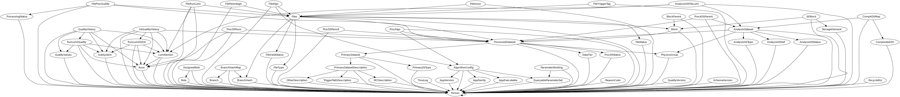
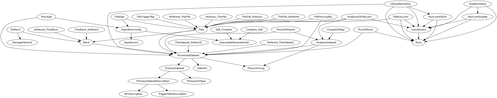
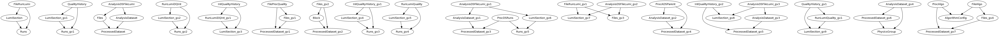
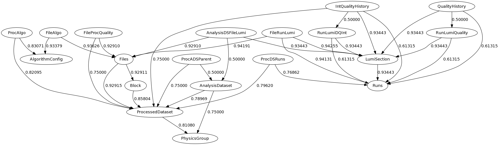
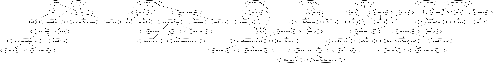

PyQB Schema Viewer
==================

.. _pyqb_schemaviewer:

Schema Viewer is assistant on reviewing the database schema and
schema graph. It generates dot graph, and ideally we will provide
more information, such as [SchemaSpy]_ does.

.. doctest::

   $ python pyquerybuilder/tools/schema_helper.py
   Usage: schema_helper.py -u <database link> -m <mapfile> 
      --view_origin 
      --view_simulate 
      --alias_mapfile=<mapfile with alias tables> 
      --view_basic_cycles 
      --view_core_graph 
      --divide_by=<file specify the splition of core graph> 
      --view_splition 

View origin schema graph
------------------------

original schema file

View simulate graph
-------------------

With **basic mapping** file we could get simulation graph with alias
tables. It's useful to generate **alias mapping**

View basic cycles
-----------------

View core graph
---------------

With **basic mapping** and **alias mapping**, we could get a cyclic core
graph. Experts is needed to review this core schema or the simulation
schema to specify a splition file to eiminate semantic ambiguous if any.

View splition
-------------

